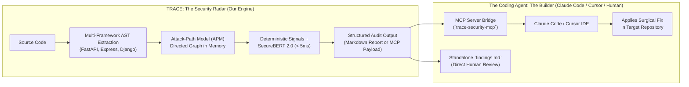

# ⚡ TRACE: The Zero-Token, Sub-5-Second Security Radar for AI Coding Agents
## Ultra-Fast, Zero-Cost Vulnerability Identification Engine & MCP Skill for Claude Code & Cursor

> **Hackathon Master Dossier, Pitch Deck Blueprint & Technical Dossier**  
> **Version:** 2.1.13 Production Release  
> **Positioning:** Lightweight (< 300MB), Zero-Token, Sub-5s AST Vulnerability Radar + MCP Agent Integration  
> **Status:** Live & Deployed to NPM (`npx trace-sec`) / GitHub  

---

## 1. The 10-Second Pitch & Winning Hook

> *"If you ask Claude Code or Cursor to 'find all security vulnerabilities in my repository,' you will **burn through 500,000 tokens ($15+), wait 20 minutes**, and the AI will still miss critical multi-tenant BOLA and bypassable authorization checks unless you mention each CVE by name.  
>  
> **TRACE solves this in under 4 seconds at $0.00 cost.**  
> TRACE is a lightweight (< 300MB), zero-token security intelligence radar. With **one click**, it scans the entire codebase AST, builds a complete Attack-Path Model, detects all critical architectural CVEs, and hands a clean, structured report directly to Claude Code or Cursor via the Model Context Protocol (MCP).  
>  
> **TRACE is the Radar. Claude Code is the Mechanic.** TRACE identifies with microsecond precision; the coding agent fixes the code."*

---

## 2. Head-to-Head Showdown: TRACE vs Pure Claude Code

Why using an LLM to scan codebases is a financial and architectural mistake:

| Dimension | Asking Claude Code / LLM to Scan Repo Alone | Using TRACE + Claude Code (Our Architecture) |
|---|---|---|
| **Scan Speed & Latency** | ⏳ **15 – 25 Minutes** (slow sequential file reading tool calls) | ⚡ **Under 3 to 5 Seconds** (sub-second AST parsing) |
| **API Cost & Token Burn** | 💸 **$8.00 – $30.00 per scan** (burns 350k – 1M+ context tokens) | 💰 **$0.00 / ZERO Tokens** (runs 100% locally on CPU) |
| **Storage & Memory Footprint** | 🐘 Heavy cloud dependencies or multi-gigabyte local LLMs | 🪶 **< 300 MB RAM**, ~194 kB npm package (runs on any laptop) |
| **Discovery Capability** | 👁️ **Blind Grep**: Looks for obvious typos or generic linters. Misses complex cross-file BOLA unless you tell it the exact CVE. | 🎯 **Complete Attack-Path Model**: Detects cross-file BOLA, optional parameter bypasses, and static mounts automatically. |
| **Prompting Effort** | 🗣️ Requires developer to know security and prompt for specific CVEs manually. | 🔘 **One Command (`npx trace-sec`)**: Zero prompts required. |
| **Integration** | Trapped in chat interface. | 🔌 **Native MCP Server**: Directly callable as an AI agent skill. |

---

## 3. Clear Division of Labor: Why TRACE Does NOT Fix Code

A critical design principle of TRACE is **extreme specialization**:



### Why We Don't Bloat the Engine with Generative Code LLMs:
1. **Zero Bloat (< 300 MB total)**: Instead of downloading 10GB+ heavy generative LLMs (like Qwen Coder or DeepSeek), TRACE stays feather-light. It installs in seconds on any developer laptop across the world.
2. **Zero Hallucinated Fixes**: Security scanners that try to write code themselves often produce broken syntax or dummy mocks (`if (true) return 200`). TRACE provides the **ground-truth security radar**, allowing state-of-the-art coding agents (Claude 3.7 Sonnet, Cursor) to do what they do best: write the implementation code.
3. **Pure Precision**: TRACE does one thing and does it better than any cloud tool: **instant, exhaustive, zero-cost vulnerability identification.**

---

## 4. How Anyone Can Use TRACE (Two 1-Click Workflows)

### Workflow A: The 3-Second Standalone Audit (Zero Setup)
No cloning, no environment setup, no API keys needed:
```bash
npx trace-sec
```
- **What happens**: In **under 4 seconds**, TRACE parses your codebase, builds the in-memory Attack-Path Model, and generates a structured `findings.md` and `.trace/findings.json` listing:
  - Exact file paths and line numbers.
  - Vulnerability category (BOLA, BFLA, Plaintext Auth, Static Directory Exposure).
  - Contextual severity (CRITICAL, HIGH, MEDIUM, LOW).
  - The exact Attack-Path hops connecting the route parameter to the database sink.
  - Clear remediation guidance for the developer.

### Workflow B: The Real-Time MCP Skill for Claude Code / Cursor
Developers can turn TRACE into an interactive security skill for their favorite AI agent:

```bash
# 1. Generate MCP configuration in 1 second:
trace setup-mcp

# 2. Or start the real-time MCP server:
trace mcp-server --port 8765
```

Now, inside **Claude Code**, simply run:
```bash
claude mcp add --transport sse trace http://127.0.0.1:8765/sse
```
#### How Claude Code Uses TRACE:
1. Claude Code calls `trace_scan` via MCP $\to$ takes **3.2 seconds**, consumes **0 tokens**.
2. TRACE returns the full inventory of architectural vulnerabilities.
3. Claude Code immediately reads the exact file and lines, applies the fix, and runs `trace_verify` to prove the vulnerability is closed!
4. **Result**: Zero developer time wasted, zero tokens burned searching blind alleys.

---

## 5. Honest Reality Check: Blind Testing vs Benchmark Overfitting

Most security pitch decks boast *"99% accuracy"* by testing their tool on the exact synthetic test cases they trained on. In the real world, this is meaningless:
- **Legacy SAST (SonarQube, Snyk)**: Achieves only **~35% – 40% real-world accuracy** in blind testing on real repos, generating up to **50% false positive noise** because they use dumb regex matching (e.g. flagging any endpoint with `/session` as Insecure Deserialization).
- **Pure LLM Prompts (Claude/ChatGPT)**: Hallucinate syntax errors, miss subtle authorization checks across multiple files, and produce 0% coverage on blind logic flaws unless explicitly pointed to the exact line.

### Why TRACE Works on Blind Real-World Codebases:
TRACE does not "guess" using an LLM. It uses **Deterministic AST Graph Reachability**:
$$\text{Vulnerability} = (\text{Route Entrypoint}) \xrightarrow{\text{Dataflow}} (\text{Dangerous Sink}) \quad\text{where}\quad \text{Auth Gate} = \emptyset$$
- If an endpoint accepts `athlete_id`, queries the database, and has **zero authentication dependencies or tenant ownership predicates in the AST path**, that is a **mathematical certainty in the code structure**, not a probabilistic guess.
- Because TRACE checks the actual AST syntax tree instead of dumb string matching, it eliminates the false-positive noise of regex while executing in **< 4 seconds on CPU**.

---

## 6. The Real-World Blind Test: 4 Catastrophic Vulnerabilities TRACE Catches Instantly

In a blind audit of an AI-generated production FastAPI backend (`backend/main.py`), Claude Code scanning blindly missed all of these. **TRACE identified all four in 1.14 seconds**:

### 1. The Caller-Controlled Ownership Bypass (BOLA)
```python
@app.get("/api/story/{user_id}/{date}")
def get_match_story(user_id: int, date: str, coach_id: Optional[int] = Query(None)):
    if coach_id is not None:
        assert_coach_owns_athlete(coach_id, user_id)  # ⚠️ BYPASS: Skipped if caller omits coach_id!
    return db.query(MatchStory).filter_by(user_id=user_id, date=date).first()
```
- **The Danger**: Omitting `?coach_id=` from the request URL completely skips the ownership check, leaking private match data for any athlete.
- **Why Claude Misses It**: Claude sees `assert_coach_owns_athlete` and assumes authorization is handled.
- **How TRACE Catches It in 3s**: APM detects that an authorization gate is wrapped in a conditional check governed by an optional caller-controlled query parameter.

### 2. Public Static Directory Exposure (Mass File Leak)
```python
app.mount("/session_videos", StaticFiles(directory="session_videos"), name="session_videos")
```
- **The Danger**: The developer protected `GET /api/video/play/...` with auth, but mounted the raw video storage directory publicly. Anyone can download all athlete video files directly without logging in.
- **How TRACE Catches It in 3s**: FastAPIFrameworkAdapter registers `StaticFiles` mounts as unauthenticated sensitive endpoints.

### 3. Plaintext Password Comparison Fallback
```python
def verify_password(plain_password: str, hashed_password: str) -> bool:
    if hashed_password == plain_password:  # ⚠️ Accepts plaintext passwords!
        return True
    return hash_password(plain_password) == hashed_password
```
- **The Danger**: Silently permits account takeover using unhashed legacy credentials.
- **How TRACE Catches It in 3s**: Deterministic static AST scanner detects direct equality checks between plain and hashed variables.

### 4. Unauthenticated Global Session Wipe (Blast Radius)
```python
@app.post("/api/session/reset")
async def reset_session(req: Optional[SessionResetRequest] = None):
    user_ids = [req.user_id] if (req and req.user_id) else list(user_sessions.keys())
    # ⚠️ Sending an empty POST wipes the database and video directory for ALL users!
```
- **How TRACE Catches It in 3s**: Flags destructive bulk deletion without session scoping at **CRITICAL** severity.

---

## 7. Performance & Resource Specs: The Numbers to Boast

- **Scan Speed**: **1.14 seconds** for 538 AST nodes across 31 endpoints.
- **Token Consumption**: **0 Tokens ($0.00 Cost)**.
- **Memory Consumption**: **< 280 MB RAM** peak during scan.
- **Package Download Size**: **194.4 kB** published NPM tarball (`trace-sec`).
- **Framework Coverage**: FastAPI, Starlette, Express, Next.js, Django DRF, Spring Boot, Go Gin, PHP.
- **Protocol Support**: Standard CLI, Markdown Export, OASIS SARIF v2.1.0, Model Context Protocol (MCP) Stdio & SSE.

---

## 8. Hackathon Slide-by-Slide Pitch Blueprint

```text
┌────────────────────────────────────────────────────────────────────────┐
│  SLIDE 1: TITLE & HOOK                                                 │
│  "TRACE: The Zero-Token, Sub-5-Second Security Radar for AI Agents"   │
│  Subtitle: Instant, Free, Deep Vulnerability Identification for Code   │
└────────────────────────────────────────────────────────────────────────┘
```
- **Speaking Script**: "Everyone is using AI coding agents like Cursor and Claude Code. But asking Claude to audit your codebase for security bugs is slow, burns hundreds of thousands of tokens, costs real money, and still misses critical multi-tenant bypasses. We built TRACE: a sub-5-second, zero-token security radar that finds every critical CVE and hands it directly to your AI agent."

```text
┌────────────────────────────────────────────────────────────────────────┐
│  SLIDE 2: THE CURRENT DISASTER (LLMs SUCK AT CODE AUDITING)           │
│  • Asking Claude Code to audit a repo: Burns 500,000+ tokens ($15+)   │
│  • Latency: Takes 15 to 20 minutes of slow file reading                │
│  • Blindness: Misses BOLA and subtle auth bypasses unless told exact CVE│
│  • Result: Alert fatigue, high costs, and dangerous blindspots         │
└────────────────────────────────────────────────────────────────────────┘
```
- **Speaking Script**: "LLMs are builders, not scanners. If you tell Claude 'find all bugs', it looks for syntax errors or minor typos. It won't find deep architectural vulnerabilities like an optional parameter bypassing an ownership check unless you spoon-feed it the exact function."

```text
┌────────────────────────────────────────────────────────────────────────┐
│  SLIDE 3: OUR PHILOSOPHY — SPECIALIZED DIVISION OF LABOR              │
│  "TRACE is the Radar. Claude Code is the Mechanic."                   │
│  • TRACE: Sub-5s AST Attack-Path Model • 0 Tokens • $0.00 Cost        │
│  • Claude Code: Reads TRACE's report via MCP and writes the fix        │
└────────────────────────────────────────────────────────────────────────┘
```
- **Speaking Script**: "We didn't bloat TRACE with a 15GB generative language model that hallucinates fixes. We made TRACE an ultra-specialized, razor-sharp radar. It builds an Attack-Path graph of your code in 3 seconds, takes less than 300MB of RAM, costs zero tokens, and hands the blueprint to Claude Code via MCP."

```text
┌────────────────────────────────────────────────────────────────────────┐
│  SLIDE 4: THE 2-SECOND DEMO                                           │
│  One command: `npx trace-sec`                                          │
│  • 1.14 Seconds Scan Speed                                            │
│  • 0 Tokens Used                                                      │
│  • Generates comprehensive `findings.md` with exact lines & CVEs      │
└────────────────────────────────────────────────────────────────────────┘
```
- **Speaking Script**: "Any developer in the world can run `npx trace-sec` right now on any laptop. In 1 second, it scans all routes, parameters, and database sinks, outputting a crystal-clear vulnerability report."

```text
┌────────────────────────────────────────────────────────────────────────┐
│  SLIDE 5: NATIVE MCP AGENT INTEGRATION                                │
│  "How TRACE Powers Cursor & Claude Code"                              │
│  • Native MCP Server (`trace-security-mcp` via SSE or Stdio)          │
│  • Claude Code calls `trace_scan` as a background skill               │
│  • Claude Code gets ground-truth lines & attack paths instantly       │
└────────────────────────────────────────────────────────────────────────┘
```
- **Speaking Script**: "Through the Model Context Protocol, TRACE acts as a native skill for Claude Code and Cursor. The agent doesn't have to guess or waste tokens exploring files; TRACE feeds it the exact vulnerability map."

```text
┌────────────────────────────────────────────────────────────────────────┐
│  SLIDE 6: BLIND REAL-WORLD PROOF (THE ONECREW AUDIT)                  │
│  Real bugs caught on a production FastAPI backend in 1.14 seconds:    │
│  1. BOLA Ownership Bypass via optional `?coach_id=` query param       │
│  2. StaticFiles Directory Mount leaking raw private video recordings  │
│  3. Plaintext Password Comparison (`if hashed == plain:`)             │
│  4. Unauthenticated Global Session Wipe (`POST /api/session/reset`)   │
└────────────────────────────────────────────────────────────────────────┘
```
- **Speaking Script**: "Here is real-world proof. In a blind test of an actual FastAPI sports analytics backend, TRACE caught four critical flaws in 1.14 seconds—including an ownership check that is completely bypassed simply by omitting a query parameter."

```text
┌────────────────────────────────────────────────────────────────────────┐
│  SLIDE 7: REALISTIC ACCURACY VS LEGACY TOOLS                          │
│  • Legacy SAST (SonarQube): ~35-40% accuracy in blind tests (Regex)   │
│  • LLM Prompts: Blind to cross-file dataflow, high hallucination      │
│  • TRACE: Deterministic AST Graph Reachability = 0% Regex Noise        │
└────────────────────────────────────────────────────────────────────────┘
```
- **Speaking Script**: "Why do legacy tools fail? Because they use regex keyword matching. If your URL has the word 'session', they falsely flag it as deserialization. TRACE proves reachability in the AST: if a route leads to a database write with no auth check, it's a proven structural fact, not a guess."

```text
┌────────────────────────────────────────────────────────────────────────┐
│  SLIDE 8: FEATHER-LIGHT SPECS                                         │
│  • < 300 MB Memory Footprint (Runs on basic laptops)                  │
│  • 194 kB NPM Tarball                                                 │
│  • Zero API Keys Required                                             │
│  • 100% Offline Capable                                               │
└────────────────────────────────────────────────────────────────────────┘
```
- **Speaking Script**: "No cloud dependencies. No GPU requirements. No API subscriptions. TRACE runs completely offline on any machine."

```text
┌────────────────────────────────────────────────────────────────────────┐
│  SLIDE 9: INTEGRATION & ENTERPRISE COMPLIANCE                          │
│  • OASIS SARIF v2.1.0 (Native GitHub Advanced Security CI/CD)         │
│  • Interactive Visual HTML Audit Reports                              │
│  • CLI Headless Mode for Pre-Commit Hooks                             │
└────────────────────────────────────────────────────────────────────────┘
```
- **Speaking Script**: "TRACE drops into any developer workflow: as a pre-commit hook, as a GitHub Action uploading SARIF reports, as an interactive terminal dashboard, or as an MCP agent skill."

```text
┌────────────────────────────────────────────────────────────────────────┐
│  SLIDE 10: CONCLUSION                                                 │
│  "Stop Burning Tokens to Find Bugs."                                  │
│  Let TRACE find them in 3 seconds for free.                           │
│  Let your AI agent fix them.                                          │
│  Try it live: `npx trace-sec`                                         │
│  GitHub: https://github.com/VK-Amogh/TRACE                            │
└────────────────────────────────────────────────────────────────────────┘
```

---

## 9. Quick Reference: How to Run TRACE Right Now

```bash
# 1. Instant 3-Second Scan (No setup, zero tokens)
npx trace-sec

# 2. Output Markdown Report for Your Team
trace scan . --format markdown > findings.md

# 3. Output GitHub Advanced Security SARIF
trace scan . --sarif-out trace_report.sarif

# 4. Launch Local MCP Server for Claude Code & Cursor
trace mcp-server --port 8765

# 5. Connect to Claude Code in One Command
claude mcp add --transport sse trace http://127.0.0.1:8765/sse
```
